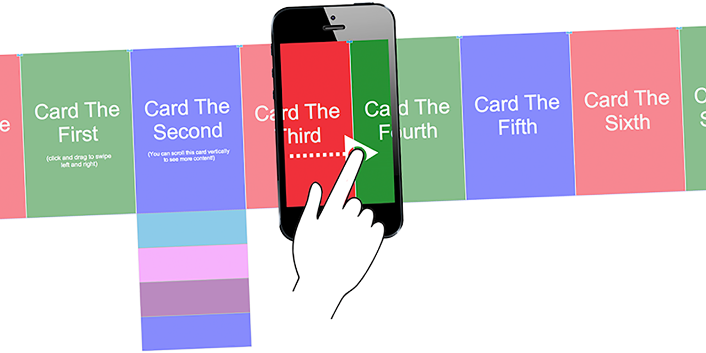

# Axure Cards

This is a widget library for Axure RP that greatly simplifies the process of creating a mobile-friendly swipeable/draggable card UI:

## Live Demo

See an example [here](https://lshillman.github.io/Axure-Cards/). Note that the card appearance and content are completely customizable.

## Installation

Download sliding_cards.rplib and open in Axure RP. This will add a library with two widgets to your "Libraries" pane: one formatted for Google Glass (I know; I made this a long time ago) and one formatted for mobile phones. Simply drag one of the widgets to your canvas, fill out the "controls" state, and customize the cards as you see fit.

Note that the .rplib file is the only thing you need. The other files in this repo are the live demo source files, auto-generated by Axure. They won't be of any use to you.

<3. [@lshillman](https://github.com/lshillman) | [personal site](https://lukehillman.net)